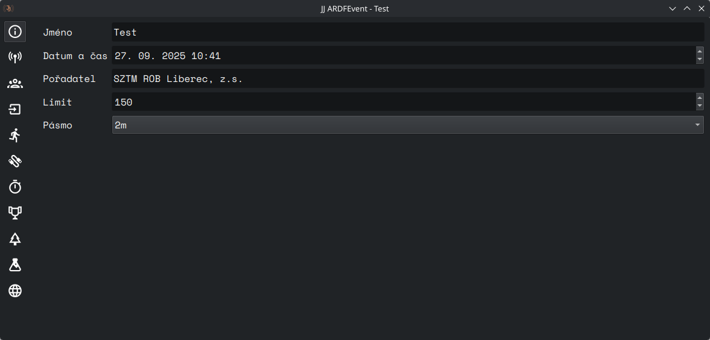

# Základní info

Spravuje základní informace o závodě.

## Ovládací prvky

- **Jméno** - název závodu zobrazený na startovce, výsledcích a lístcích
- **Datum a čas** - datum a čas prvního startu
- **Pořadatel** - název pořadatelského klubu
- **Limit** - limit v minutách dle pravidel ROB
- **Pásmo** - pásmo pro daný závod vyjádřeno vlnovou délkou (80m, 2m, kombinované)

## Ukládání změn

Změny se uloží při dokončení úprav.