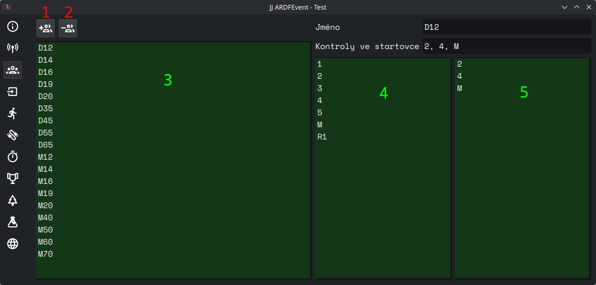

# Kategorie

Spravuje kategorie v závodě.

## Ovládací prvky

(1) **Přidat kategorii** - Přidá novou kategorii do seznamu.

(2) **Odebrat kategorii** - Odebere vybranou kategorii ze seznamu.

(3) **Seznam kategorií** - Zobrazuje všechny kategorie v závodě.

(4) **Seznam všech kontrol** - Zobrazuje všechny kontroly dostupné v závodě.

(5) **Seznam vyhledávaných kontrol** - Zobrazuje kontroly přiřazené kategorii.

- **Jméno** - název kategorie
- **Kontroly ve startovce** - _slouží již pouze ke zpětné kompatibilitě, dříve se tady upravovaly spojené kontroly_

## Ovládání

Kategorii otevřete dvojklikem na ni v seznamu kategorií (3). Následně se zobrazí její detaily v pravé části okna.

Kontrolu do kategorie přidáte dvojklikem na kontrolu v seznamu všech kontrol (4). Odeberete ji dvojklikem na kontrolu v
seznamu vyhledávaných kontrol (5).