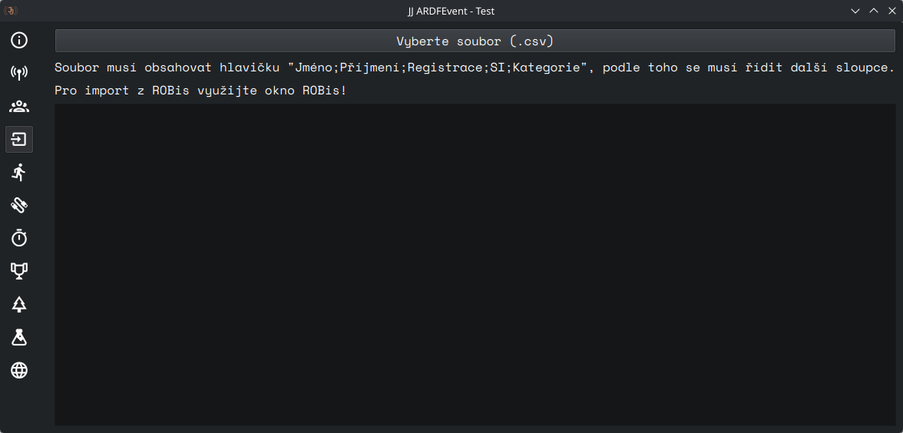

# Import

Slouží k importu kategorií a závodníků ze souboru CSV.

Slouží pouze jako záchranný nástroj, nepoužívá-li se ROBis.



## Ovládací prvky

- **Vyberte soubor (.csv)** - Otevře dialog pro výběr souboru CSV k importu.

### Formát souboru

Soubor je oddělen středníky (`;`). První řádek musí obsahovat povinnou hlavičku: ```Jméno;Příjmení;Registrace;SI```,
další řádky se podle ní řídí.