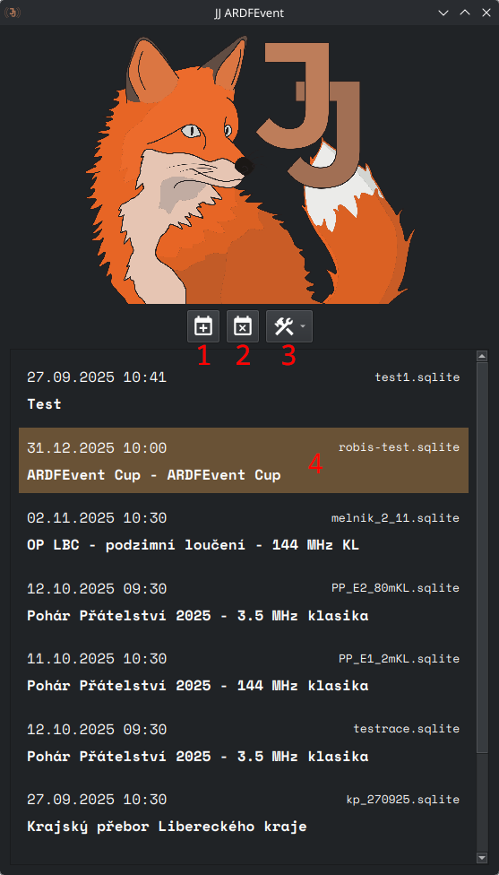

# Uvítací okno

Uvítací okno je první obrazovka, kterou uvidíte po spuštění aplikace. Vybíráte zde závod.

## Ovládací prvky

(1) **Nový závod** - Otevře dialog pro vytvoření nového závodu.

(2) **Smazat závod** - Smaže vybraný závod ze seznamu.

(3) **Nástroje** - Správce pluginů a další rozhraní, které přiadjí pluginy.

(4) **Závod** - Vyberete kliknutím, otevřete dvojklikem. Zobrazeno je jméno závodu, datum, první start a ID závodu
zadané
při vytvoření závodu.

### Vytvoření nového závodu

Klikněte na tlačítko **Nový závod** (1). Otevře se dialogové okno, kde zadáte ID závodu (název souboru se závodem).

